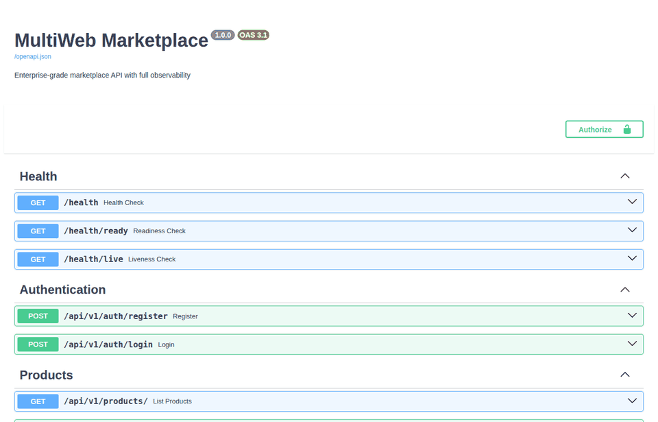
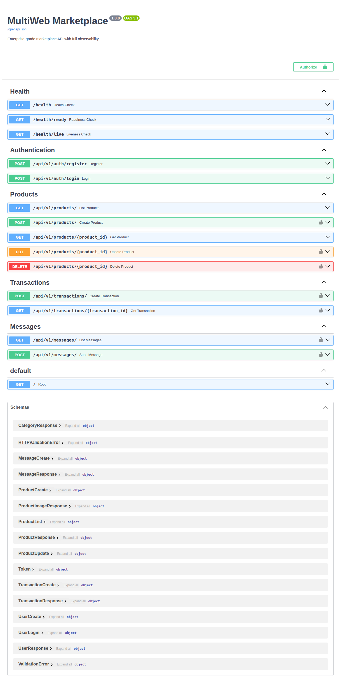
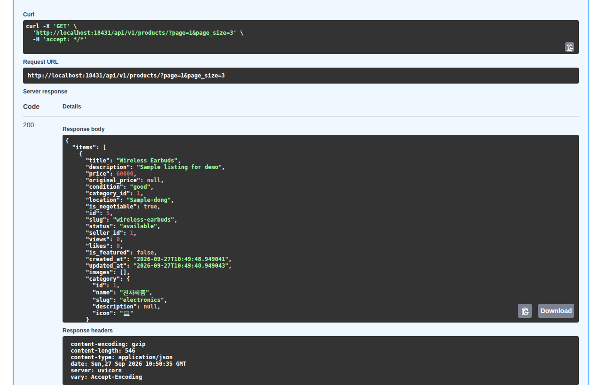
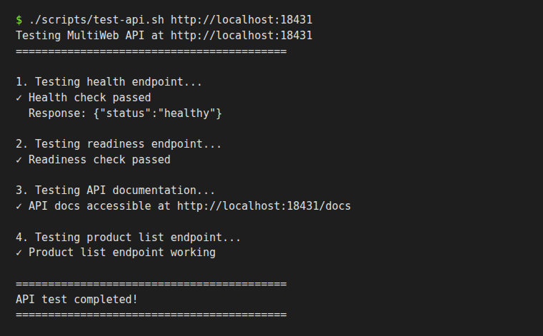

# MultiWeb

중고거래 마켓플레이스 API(Application Programming Interface)를 대상으로 모니터링·부하 테스트·데이터 분석을 연습하는 DevOps 학습 프로젝트입니다.

[English](README.en.md) | **한국어**



## 화면

| API 문서 (Swagger UI) | 상품 목록 조회 결과 |
|---|---|
|  |  |

`scripts/test-api.sh` 실행 결과:



위 화면은 모두 이 저장소의 코드를 로컬 PostgreSQL·Redis에 연결해 실제로 실행한 결과이며, 데이터는 데모 계정과 예시 상품입니다.

## 주요 기능

**마켓플레이스 API** (`app/`)
- 회원가입, 로그인, JWT(JSON Web Token, JSON은 JavaScript Object Notation) 액세스·리프레시 토큰 발급
- 상품 등록·조회·수정·삭제(소프트 삭제), 페이지 나누기, 카테고리·상태 필터, 제목·설명 검색
- 거래 생성·조회 (구매자와 판매자만 조회 가능)
- 사용자 간 메시지 보내기·목록 조회
- 헬스 체크: `/health`, `/health/ready`(DB(Database)·Redis 연결 확인), `/health/live`
- Prometheus 메트릭 노출: `/metrics`
- structlog 기반 JSON 구조화 로그

**인프라 구성 파일**
- Docker Compose: API, PostgreSQL, Redis, Prometheus, Grafana, Loki, Promtail, Tempo, Nginx (`docker-compose.yml`)
- Nginx 요청 속도 제한: API 10 r/s, 로그인 5 r/m (`docker/nginx.conf`)
- Kubernetes 매니페스트: API Deployment와 HPA(Horizontal Pod Autoscaler), PostgreSQL, Redis, Ingress, Prometheus, Grafana, Loki, Promtail, Tempo (`k8s/`)
- Kind/Minikube 로컬 클러스터 준비 스크립트 (`scripts/setup-k8s.sh`)

**테스트·분석 도구**
- Locust 부하 테스트 시나리오 (`tests/locust/marketplace_load.py`)
- 공격 시뮬레이션: HTTP(HyperText Transfer Protocol) 플러드, Slowloris, SQL(Structured Query Language) 인젝션, XSS(Cross-Site Scripting), 로그인 무차별 대입 (`tests/attacks/simulate_attacks.py`)
- Prometheus 메트릭 수집기와 Jupyter 분석 노트북 (`analytics/`)

기능별 구현 상태와 미완성 항목은 [진행 기록](docs/PROGRESS.md)에 정리했습니다.

## 사용 방법

### 1. 로컬 실행 (Docker 없이, 위 화면을 만든 방법)

PostgreSQL 16과 Redis가 로컬에서 실행 중이어야 합니다. 설정 기본값은 사용자 `multiweb`, 비밀번호 `multiweb_password`, DB `multiweb`입니다 (`app/core/config.py`).

```bash
# 1) 의존성 설치 (Python 3.12)
python -m venv .venv && source .venv/bin/activate
pip install -r app/requirements.txt

# 2) 접속 대상 설정
export POSTGRES_SERVER=localhost REDIS_HOST=localhost DEBUG=true

# 3) 테이블·카테고리·데모 계정 생성 (기존 테이블을 지우고 다시 만듭니다)
PYTHONPATH=. python scripts/init_db.py

# 4) API 서버 실행
uvicorn app.main:app --port 8000
```

`DEBUG=true`일 때만 `/docs`(Swagger UI)와 `/redoc`이 열립니다.

### 2. 기본 사용 흐름

1. 브라우저에서 `http://localhost:8000/docs`를 엽니다.
2. `POST /api/v1/auth/login`에 데모 계정으로 로그인합니다.
   ```json
   { "email": "demo@multiweb.com", "password": "demo123!" }
   ```
3. 응답의 `access_token`을 오른쪽 위 **Authorize**에 붙여 넣습니다.
4. `GET /api/v1/products/`로 상품을 조회하고, 자물쇠 표시가 있는 API(상품 등록, 거래, 메시지)를 호출합니다.

명령줄에서 확인하려면:

```bash
./scripts/test-api.sh http://localhost:8000
```

### 3. Docker Compose

```bash
docker-compose up -d
# 또는 대화형 스크립트
./scripts/quickstart.sh
```

| 서비스 | 주소 |
|---|---|
| API | http://localhost:8000 |
| Grafana | http://localhost:3000 (admin/admin) |
| Prometheus | http://localhost:9090 |
| Nginx | http://localhost:80 |

이 환경에서는 Docker 데몬을 쓸 수 없어 Compose 실행은 확인하지 못했습니다. API 컨테이너의 모듈 경로 문제 등 확인된 사항은 [진행 기록](docs/PROGRESS.md)에 적었습니다.

### 4. Kubernetes

```bash
cd scripts && ./setup-k8s.sh
```

자세한 절차는 [배포 가이드](docs/DEPLOYMENT.md)를 참고하세요.

### 5. 부하 테스트와 공격 시뮬레이션

```bash
pip install -r tests/locust/requirements.txt
cd tests/locust
locust -f marketplace_load.py --host=http://localhost:8000
```

```bash
pip install -r tests/attacks/requirements.txt
python tests/attacks/simulate_attacks.py
```

공격 시뮬레이션은 본인이 운영하는 로컬 환경에서만 실행하세요.

### 6. 데이터 분석

```bash
pip install -r analytics/collectors/requirements.txt
python analytics/collectors/collect_metrics.py   # Prometheus(localhost:9090)에서 수집
jupyter lab analytics/notebooks/metrics_analysis.ipynb
```

## 기술 스택

| 영역 | 사용 기술 (저장소에 고정된 버전) |
|---|---|
| 언어 | Python 3.12 (`app/Dockerfile`) |
| 웹 프레임워크 | FastAPI 0.115.0, Uvicorn 0.30.6, Pydantic 2.9.0, pydantic-settings 2.5.0 |
| DB·ORM(Object-Relational Mapping) | PostgreSQL 16, SQLAlchemy 2.0.35 (asyncio), asyncpg 0.29.0 |
| 캐시 | Redis 7.2, redis-py 5.1.0 |
| 인증 | python-jose 3.3.0 (JWT), passlib 1.7.4 + bcrypt 4.2.0 |
| 관측 | prometheus-fastapi-instrumentator 7.0.0, structlog 24.4.0, Prometheus v2.53.0, Grafana 11.0.0, Loki·Promtail 3.0.0, Tempo 2.5.0 |
| 인프라 | Docker Compose, Nginx, Kubernetes (Deployment, HPA, Ingress, DaemonSet) |
| 테스트·분석 | Locust 2.31.0, httpx 0.27.2, Faker 30.3.0, pandas 2.2.3, NumPy 2.1.3, Matplotlib 3.9.2, seaborn 0.13.2 |

## 문서

- [진행 기록 (최종 목표, 구현 상태, 작업 이력)](docs/PROGRESS.md)
- [아키텍처](docs/ARCHITECTURE.md)
- [배포 가이드](docs/DEPLOYMENT.md)
- [모니터링 가이드](docs/MONITORING.md)
- [검토 리포트 (2025-11-23)](docs/REVIEW.md)

## 라이선스

MIT License. 학습용 프로젝트이며, `k8s/base/secret.yaml`과 `app/core/config.py`의 비밀번호·키는 로컬 개발용 기본값이므로 실제 환경에서는 환경 변수로 바꿔야 합니다.
